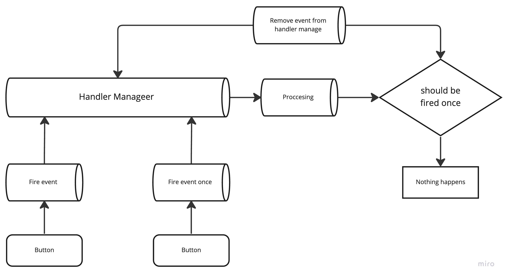

## Example
```typescript
// Handlers ids
export const EVENT_ID = "example_event_id";
export const EVENT_ONCE_ID = "example_once_event_id";

// Child Component
import { useHandlersManager } from 'HandlerManager';

export const ChildComponentWithHandlers = () => {
	const { callEvent, callEventOnce } = useHandlersManager();
	
	const handleCallEventCallback = useCallback(() => {
		callEvent(EVENT_ID, { 
			payload: { // payload is optional
				message: "button is clicked",
			} 
		});
	}, [callEvent]);
	
	const handleCallEventOnceCallback = useCallback(() => {
		callEventOnce(EVENT_ONCE_ID, { 
			payload: { // payload is optional
				message: "button is clicked once", 
			} 
		});
	}, [callEvent]);
		
	return (
		<>
			<button onClick={handleCallEventCallback}>Click event</button>
			<button onClick={handleCallEventOnceCallback}>Click event once</button>
		</>
	)
}

// Parent Component
import { HandlersManagerProvider } from 'HandlerManager';

export const handlers = {
	EVENT_ID: [() => {}, () => {}], // can be array of function
	EVENT_ONCE_ID: () => {},
};

export const ParentComponent = () => {
	return (
		<HandlerManager.Provider handlers={handlers}>
			<ChildComponentWithHandlers />
		</HandlerManager>
	);
}
```

## Visual


